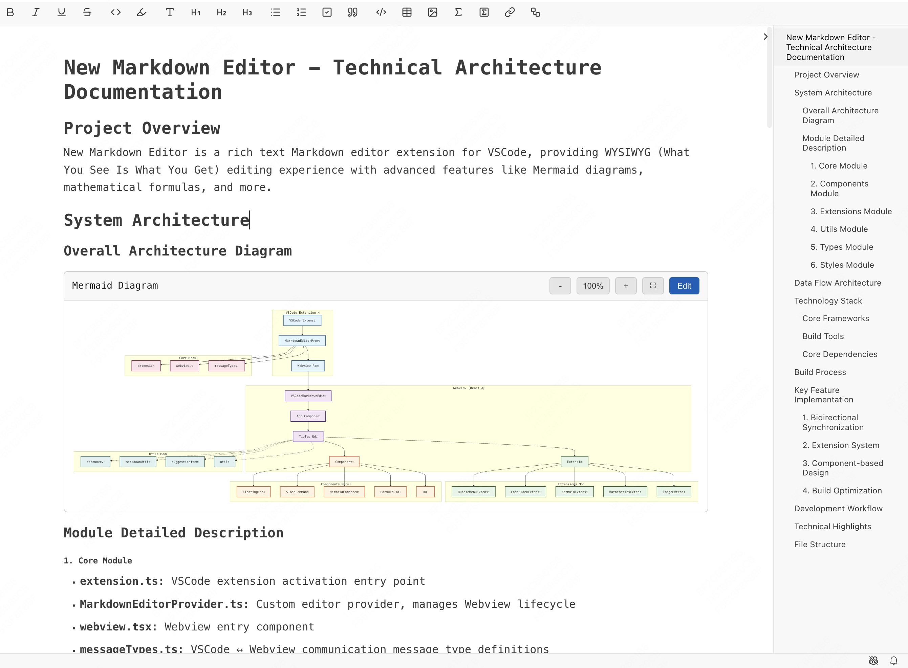

# New Markdown Editor - Rich WYSIWYG Markdown Editor for VSCode

<div align="center">


**A modern, feature-rich WYSIWYG Markdown editor that brings the power of rich text editing to VSCode**

[Features](#-features) • [Installation](#-installation) • [Quick Start](#-quick-start) • [Screenshots](#-screenshots)

🌐 **Read in other languages**: [中文](README.zh-CN.md) • [日本語](README.ja-JP.md) • [한국어](README.ko-KR.md) • [Deutsch](README.de-DE.md)

</div>

## ✨ Why New Markdown Editor?

Tired of switching between source code and preview mode? **New Markdown Editor** revolutionizes your Markdown workflow by providing a true WYSIWYG (What You See Is What You Get) experience directly in VSCode.

### 🚀 Key Benefits

- **No More Preview Tabs**: Edit and see the final result simultaneously
- **Rich Visual Editing**: Bold, italics, tables, and more with intuitive controls
- **Advanced Features**: Mermaid diagrams, mathematical formulas, and code highlighting
- **Seamless Integration**: Native VSCode experience with full extension compatibility

## 🎯 Features

### Rich Text Editing
- **Bold, Italic, Underline**: Format text with familiar shortcuts
- **Headings (H1-H6)**: Structure your documents with proper hierarchy
- **Lists**: Ordered, unordered, and task lists
- **Tables**: Create and edit tables visually
- **Links & Images**: Insert and manage with ease

### Advanced Markdown Support
- **Code Blocks**: Syntax highlighting for 100+ programming languages
- **Mermaid Diagrams**: Render flowcharts, sequence diagrams, and more
- **Mathematical Formulas**: LaTeX support with KaTeX rendering
- **Slash Commands**: Quick insertion of common elements

### Enhanced User Experience
- **Floating Toolbar**: Context-aware formatting tools
- **Bubble Menus**: Quick access to formatting options
- **Full-Screen Preview**: Focus on your content
- **Real-time Updates**: Instant visual feedback

## 📦 Installation

### From VSCode Marketplace
1. Open VSCode Extensions panel (`Ctrl+Shift+X` / `Cmd+Shift+X`)
2. Search for "New Markdown Editor"
3. Click **Install**

### From VSIX File
```bash
code --install-extension new-markdown-editor-1.0.0.vsix
```

## 🚀 Quick Start

1. **Open a Markdown file** (`.md` extension)
2. **Right-click** the file and select "Open With"
3. **Choose "New Markdown Editor"**
4. **Start editing** with rich text controls!

### 🎹 Quick Actions
- `Ctrl+B` / `Cmd+B` - **Bold** text
- `Ctrl+I` / `Cmd+I` - **Italic** text
- `Ctrl+K` / `Cmd+K` - Insert **link**
- `/` - Open **slash command** menu
- `Ctrl+Shift+P` - **Full-screen** preview

## 📊 Mermaid Diagram Support

Create beautiful diagrams directly in your Markdown:

- **Flowcharts** - Process flows and decision trees
- **Sequence Diagrams** - System interactions
- **Class Diagrams** - Object-oriented designs
- **State Diagrams** - State transitions
- **Gantt Charts** - Project timelines
- **Pie Charts** - Data visualization

## 🎨 Screenshots

### Rich Text Editor Interface

*Experience seamless WYSIWYG editing with intuitive formatting controls*

### Advanced Features & Diagrams

*Create Mermaid diagrams, mathematical formulas, and code blocks with syntax highlighting*

## 🔧 Technical Highlights

- **Modern Stack**: Built with React 19, TypeScript, and TipTap
- **VSCode Native**: Full integration with VSCode APIs
- **Performance Optimized**: Fast rendering and smooth editing
- **Extensible**: Plugin-based architecture for easy customization

## 🤝 Contributing

We welcome contributions! Feel free to submit issues, feature requests, or pull requests.

## 📄 License

MIT License - feel free to use this project in your own work.

---

<div align="center">

**Transform your Markdown editing experience in VSCode today!**

⭐ **Star this project** if you find it useful!

</div>