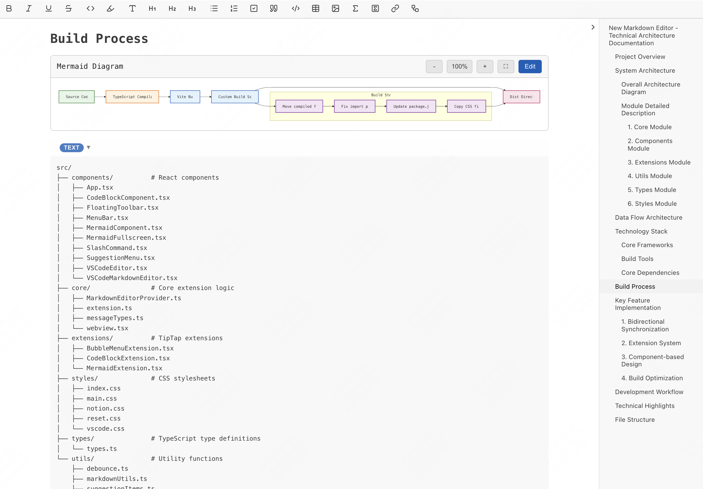

# New Markdown Editor - VSCode 富文本 Markdown 编辑器

<div align="center">


**一款现代化的富文本 Markdown 编辑器，为 VSCode 带来所见即所得的编辑体验**

[功能特性](#-功能特性) • [安装指南](#-安装指南) • [快速开始](#-快速开始) • [截图展示](#-截图展示)

</div>

## ✨ 为什么选择 New Markdown Editor？

厌倦了在源代码和预览模式之间切换？**New Markdown Editor** 通过在 VSCode 中提供真正的所见即所得（WYSIWYG）体验，彻底改变您的 Markdown 工作流程。

### 🚀 核心优势

- **无需预览标签页**：同时编辑并查看最终结果
- **丰富的可视化编辑**：直观的粗体、斜体、表格等控件
- **高级功能**：Mermaid 图表、数学公式和代码高亮
- **无缝集成**：原生 VSCode 体验，完全兼容其他扩展

## 🎯 功能特性

### 富文本编辑
- **粗体、斜体、下划线**：使用熟悉的快捷键格式化文本
- **标题（H1-H6）**：使用适当的层次结构组织文档
- **列表**：有序列表、无序列表和任务列表
- **表格**：可视化创建和编辑表格
- **链接和图片**：轻松插入和管理

### 高级 Markdown 支持
- **代码块**：支持 100+ 种编程语言的语法高亮
- **Mermaid 图表**：渲染流程图、序列图等
- **数学公式**：使用 KaTeX 渲染的 LaTeX 支持
- **斜杠命令**：快速插入常用元素

### 增强的用户体验
- **浮动工具栏**：上下文感知的格式化工具
- **气泡菜单**：快速访问格式化选项
- **全屏预览**：专注于您的内容
- **实时更新**：即时视觉反馈

## 📦 安装指南

### 从 VSCode 市场安装
1. 打开 VSCode 扩展面板 (`Ctrl+Shift+X` / `Cmd+Shift+X`)
2. 搜索 "New Markdown Editor"
3. 点击 **安装**

### 从 VSIX 文件安装
```bash
code --install-extension new-markdown-editor-1.0.0.vsix
```

## 🚀 快速开始

1. **打开一个 Markdown 文件** (`.md` 扩展名)
2. **右键点击**文件并选择 "打开方式"
3. **选择 "New Markdown Editor"**
4. **开始使用富文本控件进行编辑！**

### 🎹 快速操作
- `Ctrl+B` / `Cmd+B` - **粗体**文本
- `Ctrl+I` / `Cmd+I` - **斜体**文本
- `Ctrl+K` / `Cmd+K` - 插入**链接**
- `/` - 打开**斜杠命令**菜单
- `Ctrl+Shift+P` - **全屏**预览

## 📊 Mermaid 图表支持

直接在 Markdown 中创建精美的图表：

- **流程图** - 流程和决策树
- **序列图** - 系统交互
- **类图** - 面向对象设计
- **状态图** - 状态转换
- **甘特图** - 项目时间线
- **饼图** - 数据可视化

## 🎨 截图展示

### 富文本编辑器界面

*体验直观的格式化控件，享受无缝的所见即所得编辑*

### 高级功能和图表

*创建 Mermaid 图表、数学公式和带语法高亮的代码块*

## 🔧 技术亮点

- **现代技术栈**：基于 React 19、TypeScript 和 TipTap 构建
- **VSCode 原生**：与 VSCode API 完全集成
- **性能优化**：快速渲染和流畅编辑
- **可扩展性**：基于插件的架构，易于定制

## 🤝 贡献

我们欢迎贡献！请随时提交问题、功能请求或拉取请求。

## 📄 许可证

MIT 许可证 - 欢迎在您自己的工作中使用此项目。

---

<div align="center">

**立即在 VSCode 中体验全新的 Markdown 编辑体验！**

⭐ **如果觉得有用，请给这个项目点个星！**

</div>