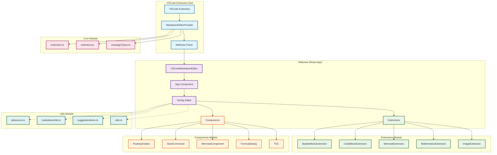
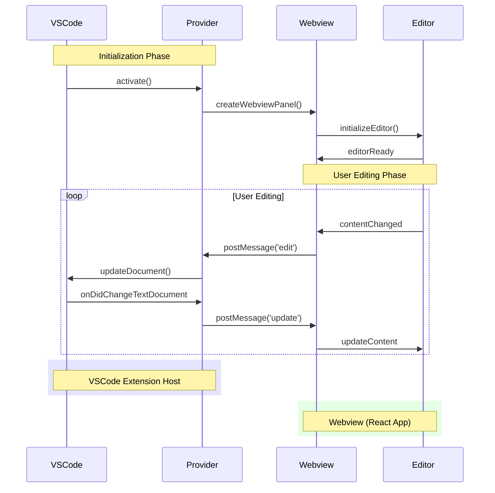

# New Markdown Editor - Technical Architecture Documentation

## Project Overview

New Markdown Editor is a rich text Markdown editor extension for VSCode, providing WYSIWYG (What You See Is What You Get) editing experience with advanced features like Mermaid diagrams, mathematical formulas, and more.

## Technology Stack

### Core Frameworks
- **VSCode Extension API**: VSCode extension development framework
- **React 19**: Frontend UI framework
- **TypeScript**: Type-safe JavaScript
- **TipTap**: Rich text editor framework

### Build Tools
- **Vite**: Frontend build tool
- **TypeScript Compiler**: TypeScript compilation
- **Custom Build Script**: Custom build automation

### Core Dependencies
- **@tiptap/react**: TipTap React integration
- **@tiptap/starter-kit**: TipTap base functionality package
- **mermaid**: Diagram rendering
- **katex**: Mathematical formula rendering
- **lucide-react**: Icon library

## System Architecture

### Overall Architecture Diagram



### Module Detailed Description

#### 1. Core Module
- **extension.ts**: VSCode extension activation entry point
- **MarkdownEditorProvider.ts**: Custom editor provider, manages Webview lifecycle
- **webview.tsx**: Webview entry component
- **messageTypes.ts**: VSCode ↔ Webview communication message type definitions

#### 2. Components Module
- **App.tsx**: Application root component
- **VSCodeMarkdownEditor.tsx**: Main editor component
- **FloatingToolbar.tsx**: Floating toolbar
- **SlashCommand.tsx**: Slash command menu
- **MermaidComponent.tsx**: Mermaid diagram component
- **FormulaDialog.tsx**: Mathematical formula dialog
- **TOC.tsx**: Table of contents component
- **CodeBlockComponent.tsx**: Code block component

#### 3. Extensions Module
- **BubbleMenuExtension.tsx**: Bubble menu extension
- **CodeBlockExtension.tsx**: Code block extension
- **MermaidExtension.tsx**: Mermaid diagram extension
- **MathematicsExtension.tsx**: Mathematical formula extension
- **ImageExtension.tsx**: Image extension

#### 4. Utils Module
- **debounce.ts**: Debounce function
- **markdownUtils.ts**: Markdown processing utilities
- **suggestionItems.ts**: Suggestion menu items configuration
- **utils.ts**: General utility functions

#### 5. Types Module
- **types.ts**: TypeScript type definitions

#### 6. Styles Module
- **reset.css**: CSS reset styles
- **vscode.css**: VSCode theme styles
- **main.css**: Main stylesheet

## Data Flow Architecture



## Build Process

```mermaid
graph LR
    A[Source Code]:::source --> B[TypeScript Compilation]:::compilation
    B --> C[Vite Build]:::build
    C --> D[Custom Build Script]:::build
    D --> E[Dist Directory]:::output

    subgraph "Build Steps"
        F[Move compiled files]:::buildstep
        G[Fix import paths]:::buildstep
        H[Update package.json]:::buildstep
        I[Copy CSS files]:::buildstep
    end

    D --> F
    F --> G
    G --> H
    H --> I
    I --> E

    classDef source fill:#e8f5e8,stroke:#2e7d32,stroke-width:2px
    classDef compilation fill:#fff3e0,stroke:#ef6c00,stroke-width:2px
    classDef build fill:#e3f2fd,stroke:#1565c0,stroke-width:2px
    classDef output fill:#fce4ec,stroke:#c2185b,stroke-width:2px
    classDef buildstep fill:#f3e5f5,stroke:#7b1fa2,stroke-width:2px
```



## Key Feature Implementation

### 1. Bidirectional Synchronization
- **VSCode ↔ Webview**: Bidirectional communication via `postMessage`
- **Real-time Updates**: Automatic content synchronization on document changes
- **State Management**: Maintains editor state consistency

### 2. Extension System
- **TipTap Extensions**: Modular editor functionality extensions
- **Custom Extensions**: Custom extensions for specific features
- **Plugin Architecture**: Easy to add new features

### 3. Component-based Design
- **React Components**: Reusable UI components
- **Props Passing**: Clear component interfaces
- **State Management**: Shared state between components

### 4. Build Optimization
- **Vite Build**: Fast development builds
- **TypeScript**: Type-safe development experience
- **Modular Output**: Optimized bundle structure

## Development Workflow

1. **Development Mode**: `npm run dev` - Watch both extension and Webview changes
2. **Build**: `npm run build` - Complete build process
3. **Testing**: Test in VSCode Extension Development Host
4. **Packaging**: `npm run package` - Generate VSIX package

## Technical Highlights

- **Modern Technology Stack**: React 19 + TypeScript + Vite
- **Rich Editor Features**: Rich text editing based on TipTap
- **Deep VSCode Integration**: Native VSCode extension experience
- **Modular Architecture**: Clear code organization and responsibility separation
- **Type Safety**: Comprehensive TypeScript type definitions
- **Build Optimization**: Efficient development and build processes

## File Structure

```
src/
├── components/          # React components
│   ├── App.tsx
│   ├── CodeBlockComponent.tsx
│   ├── FloatingToolbar.tsx
│   ├── MenuBar.tsx
│   ├── MermaidComponent.tsx
│   ├── MermaidFullscreen.tsx
│   ├── SlashCommand.tsx
│   ├── SuggestionMenu.tsx
│   ├── VSCodeEditor.tsx
│   └── VSCodeMarkdownEditor.tsx
├── core/                # Core extension logic
│   ├── MarkdownEditorProvider.ts
│   ├── extension.ts
│   ├── messageTypes.ts
│   └── webview.tsx
├── extensions/          # TipTap extensions
│   ├── BubbleMenuExtension.tsx
│   ├── CodeBlockExtension.tsx
│   └── MermaidExtension.tsx
├── styles/              # CSS stylesheets
│   ├── index.css
│   ├── main.css
│   ├── notion.css
│   ├── reset.css
│   └── vscode.css
├── types/               # TypeScript type definitions
│   └── types.ts
└── utils/               # Utility functions
    ├── debounce.ts
    ├── markdownUtils.ts
    ├── suggestionItems.ts
    └── utils.ts
```