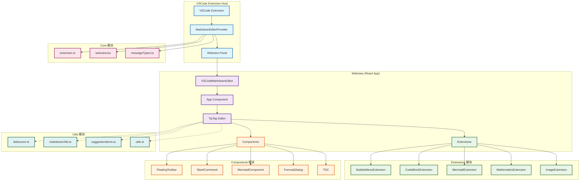
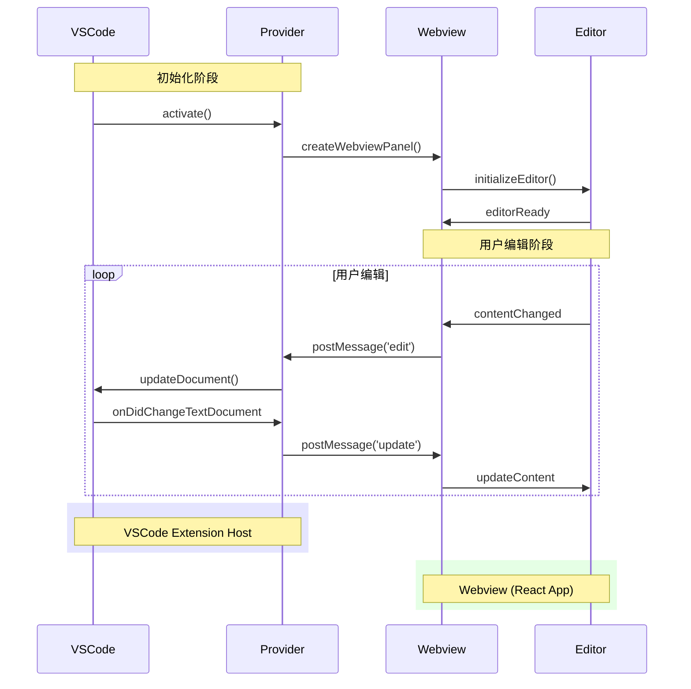

# New Markdown Editor - 技术架构文档

## 项目概述

New Markdown Editor 是一个基于 VSCode 的富文本 Markdown 编辑器扩展，提供 WYSIWYG（所见即所得）编辑体验，支持 Mermaid 图表、数学公式等高级功能。

## 技术栈

### 核心框架
- **VSCode Extension API**: VSCode 扩展开发框架
- **React 19**: 前端 UI 框架
- **TypeScript**: 类型安全的 JavaScript
- **TipTap**: 富文本编辑器框架

### 构建工具
- **Vite**: 前端构建工具
- **TypeScript Compiler**: TypeScript 编译
- **Custom Build Script**: 自定义构建脚本

### 核心依赖
- **@tiptap/react**: TipTap React 集成
- **@tiptap/starter-kit**: TipTap 基础功能包
- **mermaid**: 图表渲染
- **katex**: 数学公式渲染
- **lucide-react**: 图标库

## 系统架构

### 整体架构图

### 模块详细说明

#### 1. Core 模块
- **extension.ts**: VSCode 扩展激活入口
- **MarkdownEditorProvider.ts**: 自定义编辑器提供者，管理 Webview 生命周期
- **webview.tsx**: Webview 入口组件
- **messageTypes.ts**: VSCode 与 Webview 通信消息类型定义

#### 2. Components 模块
- **App.tsx**: 应用根组件
- **VSCodeMarkdownEditor.tsx**: 主编辑器组件
- **FloatingToolbar.tsx**: 浮动工具栏
- **SlashCommand.tsx**: 斜杠命令菜单
- **MermaidComponent.tsx**: Mermaid 图表组件
- **FormulaDialog.tsx**: 数学公式对话框
- **TOC.tsx**: 目录组件
- **CodeBlockComponent.tsx**: 代码块组件

#### 3. Extensions 模块
- **BubbleMenuExtension.tsx**: 气泡菜单扩展
- **CodeBlockExtension.tsx**: 代码块扩展
- **MermaidExtension.tsx**: Mermaid 图表扩展
- **MathematicsExtension.tsx**: 数学公式扩展
- **ImageExtension.tsx**: 图片扩展

#### 4. Utils 模块
- **debounce.ts**: 防抖函数
- **markdownUtils.ts**: Markdown 处理工具
- **suggestionItems.ts**: 建议菜单项配置
- **utils.ts**: 通用工具函数

#### 5. Types 模块
- **types.ts**: TypeScript 类型定义

#### 6. Styles 模块
- **reset.css**: CSS 重置样式
- **vscode.css**: VSCode 主题样式
- **main.css**: 主样式文件

## 数据流架构

## 构建流程

```mermaid
graph LR
    A[Source Code]:::source --> B[TypeScript Compilation]:::compilation
    B --> C[Vite Build]:::build
    C --> D[Custom Build Script]:::build
    D --> E[Dist Directory]:::output

    subgraph "Build Steps"
        F[Move compiled files]:::buildstep
        G[Fix import paths]:::buildstep
        H[Update package.json]:::buildstep
        I[Copy CSS files]:::buildstep
    end

    D --> F
    F --> G
    G --> H
    H --> I
    I --> E

    classDef source fill:#e8f5e8,stroke:#2e7d32,stroke-width:2px
    classDef compilation fill:#fff3e0,stroke:#ef6c00,stroke-width:2px
    classDef build fill:#e3f2fd,stroke:#1565c0,stroke-width:2px
    classDef output fill:#fce4ec,stroke:#c2185b,stroke-width:2px
    classDef buildstep fill:#f3e5f5,stroke:#7b1fa2,stroke-width:2px
```

## 关键特性实现

### 1. 双向同步机制
- **VSCode ↔ Webview**: 通过 `postMessage` 实现双向通信
- **实时更新**: 文档变更时自动同步内容
- **状态管理**: 保持编辑器状态一致性

### 2. 扩展系统
- **TipTap 扩展**: 模块化编辑器功能扩展
- **自定义扩展**: 针对特定功能的自定义扩展
- **插件化架构**: 易于添加新功能

### 3. 组件化设计
- **React 组件**: 可复用的 UI 组件
- **Props 传递**: 清晰的组件接口
- **状态管理**: 组件间状态共享

### 4. 构建优化
- **Vite 构建**: 快速的开发构建
- **TypeScript**: 类型安全的开发体验
- **模块化输出**: 优化的打包结构

## 开发工作流

1. **开发模式**: `npm run dev` - 同时监听扩展和 Webview 变化
2. **构建**: `npm run build` - 完整构建流程
3. **测试**: 在 VSCode 扩展开发主机中测试
4. **打包**: `npm run package` - 生成 VSIX 包

## 技术亮点

- **现代化技术栈**: React 19 + TypeScript + Vite
- **丰富的编辑器功能**: 基于 TipTap 的富文本编辑
- **VSCode 深度集成**: 原生 VSCode 扩展体验
- **模块化架构**: 清晰的代码组织和职责分离
- **类型安全**: 全面的 TypeScript 类型定义
- **构建优化**: 高效的开发和构建流程